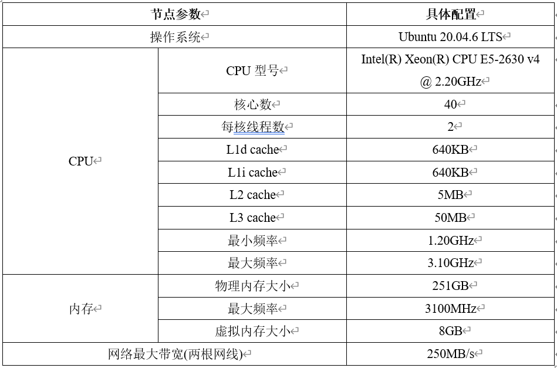
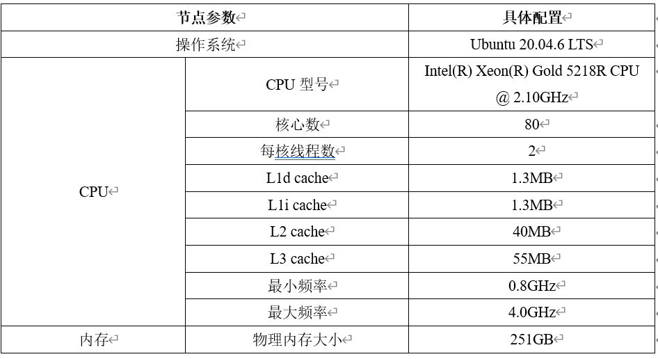

# MPI 多进程排序实验

课程大作业，MPI多进程编程

## 硬件配置
1. 节点1(ubuntu节点)：

2. 节点2(pc节点)：

## 软件配置
1. openmpi-4.1.6
2. ssh
3. vscode

## 实验过程
随机生成256M、1G、4G个浮点数，并使用P个进程对齐进行排序。
### 代码编译
```bash
git clone https://github.com/xiaotantanya/MPI_EXP.git
cd MPI_EXP
mkdir build
cd build && cmake ..
# linux
make
# windows
cd .. && cmake --build build
```
### 单进程快速排序法
运行指令：
```bash
cd build
# 256M
./fast_sort_single 256M
# 1G
./fast_sort_single 1G
# 4G
./fast_sort_single 4G
```
1. 节点1(ubuntu节点)上串行排序时间

2. 节点2(pc节点)上串行排序时间


### 多进程奇偶排序
运行指令：

**注意：多节点多进程--mca参数和--hostfile参数要更具自己的情况进行修改！**
```bash
cd build

# 256M on single node
mpirun -n 8 ./odd_even_sort 256M
# 256M on mutiple nodes
mpiexec --mca pml ob1 --mca btl tcp,self --mca btl_tcp_if_include 202.38.247.204/24 -n 8 --hostfile host ./odd_even_sort 256M

# 1G on single node
mpirun -n 8 ./odd_even_sort 1G
# 1G on mutiple nodes
mpiexec --mca pml ob1 --mca btl tcp,self --mca btl_tcp_if_include 202.38.247.204/24 -n 8 --hostfile host ./odd_even_sort 1G

# 4G on single node
mpirun -n 8 ./odd_even_sort 4G
# 4G on mutiple nodes
mpiexec --mca pml ob1 --mca btl tcp,self --mca btl_tcp_if_include 202.38.247.204/24 -n 8 --hostfile host ./odd_even_sort 4G
```
排序时间：


### 多进程PSRS排序

运行指令：

**注意：多节点多进程--mca参数和--hostfile参数要更具自己的情况进行修改！**
```bash
cd build

# 256M on single node
mpirun -n 8 ./PSRS 256M
# 256M on mutiple nodes
mpiexec --mca pml ob1 --mca btl tcp,self --mca btl_tcp_if_include 202.38.247.204/24 -n 8 --hostfile host ./PSRS 256M

# 1G on single node
mpirun -n 8 ./PSRS 1G
# 1G on mutiple nodes
mpiexec --mca pml ob1 --mca btl tcp,self --mca btl_tcp_if_include 202.38.247.204/24 -n 8 --hostfile host ./PSRS 1G

# 4G on single node
mpirun -n 8 ./PSRS 4G
# 4G on mutiple nodes
mpiexec --mca pml ob1 --mca btl tcp,self --mca btl_tcp_if_include 202.38.247.204/24 -n 8 --hostfile host ./PSRS 4G
```
排序时间：


## 待解决问题
1. MPI_Barrier() 不会将所有进程停在同一起跑线上？
2. 头文件中变量重定义？

## 相关资料
1. 多节点通信问题相关资料：
   * https://github.com/open-mpi/ompi/issues/4963
2. MPI_Send 和 MPI_Recv死锁资料：
    * https://mpitutorial.com/tutorials/point-to-point-communication-application-random-walk/zh_cn/
    * https://blog.csdn.net/susan_wang1/article/details/50068439

    * 尽管 MPI_Send 是一个阻塞调用，但是 MPI 规范 表明 MPI_Send 会一直阻塞，直到可以回收发送缓冲区为止。 这意味着当网络可以缓冲消息时，MPI_Send 将返回。 如果发送最终无法被网络缓冲，它们将一直阻塞直到发布匹配的接收。 在我们的例子中，有足够多的小发送和频繁匹配的接收而不必担心死锁，但是，永远不该假定有足够大的网络缓冲区。

    * 结论：不一定会报错，缓冲区没满的时候就不会报错，传递数据太多就会导致死锁。

       

